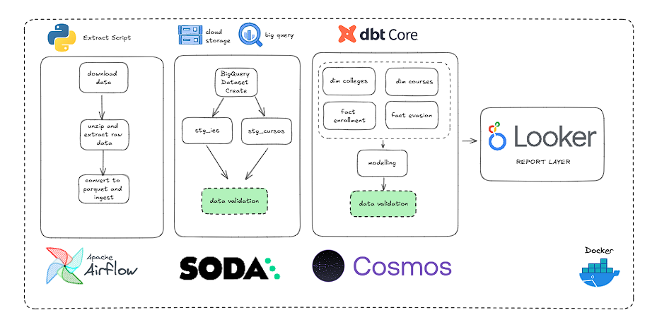

# Motivação

Este projeto foi feito para estudar técnologias da GCP e como organizar técnologias como DBT e SODA junto do Airflow.  A arquitetura visa exemplificar uma extração de dados do INEP do Censo Superior e modelar tabelas de interesse no modelo estrela de Kimball enquanto se cuida da qualidade dos dados usando SODA.

## Arquitetura proposta

## Desafios

Os principais desafios para este projeto foi a integrção entre as ferramentas o que me fez ler muita documentação de como juntar todas essas peças juntas em um único projeto e também entender como funcionava o GCP e seus operadores no Airflow.
